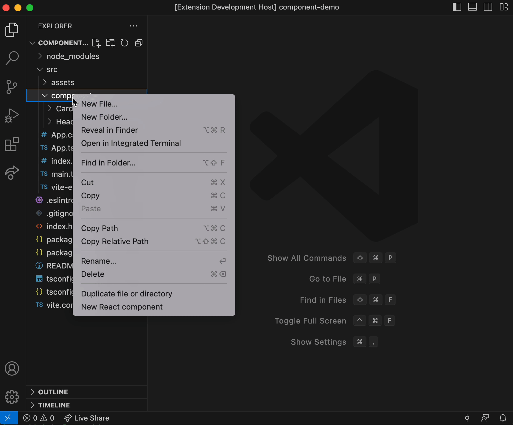

# Fast React component generator for Vscode

One-click generator to create new React components based on best practices.

It will create:

- A new folder
- - __tests__/{name}.tsx
- - {name}.tsx
- - use-{name}.ts
- - constants.tsx
- - type.tsx
- - styles.scss
- - index.ts

`name` must be a kebab-case string

## Demo

## Release Notes

### 1.2.0

Rework generated files type for personal use and manage override files/folders

### 1.1.0

Add user selectable options for SCSS, CSS modules and Storybook.

### 1.0.0

Initial release of the Fast React component generator.
